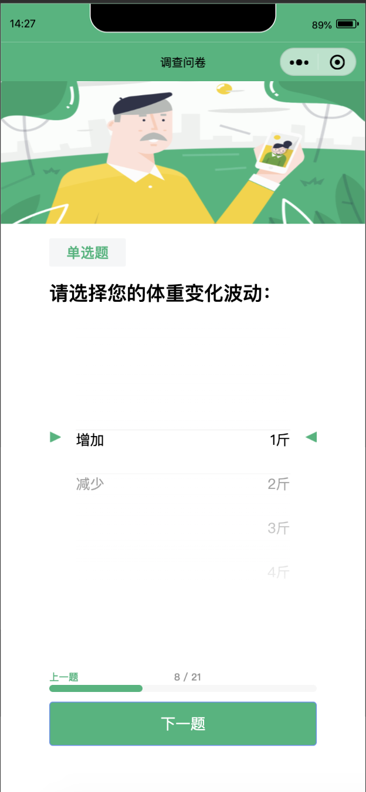
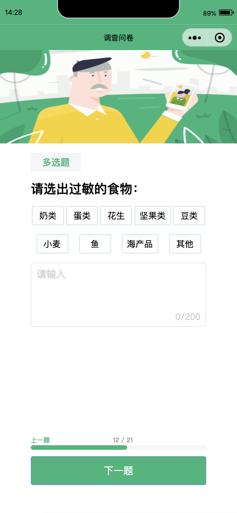
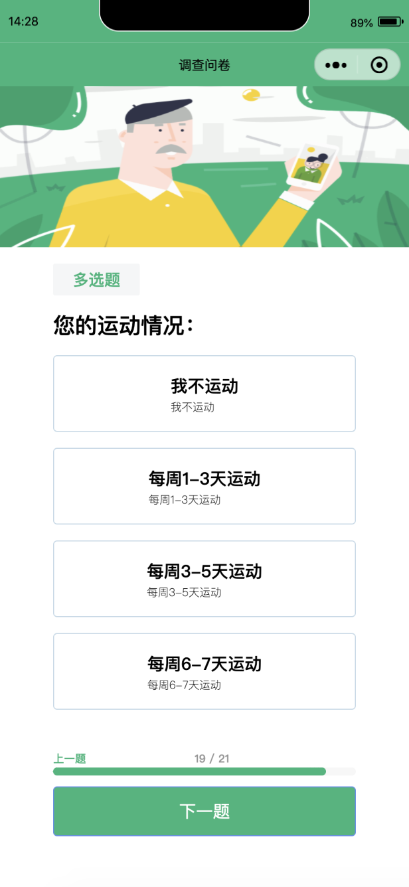

## Demo

| 滚轮页面              | 多选页面              | 单选页面              |
| --------------------- | --------------------- | --------------------- |
|  |  |  |

[](https://youtu.be/CSWOT8eK-yA)

## Develop

1. taro + taro UI 完成小程序+h5 多端适用
2. leancloud 免费 tier 接入小程序 sdk
3. 微信授权登陆
   https://nervjs.github.io/taro/docs/apis/open-api/user-info/getUserInfo/
4. 框架

```
-- asset
-- data (用户信息format, 问卷，选择...)
-- pages
   -- index: question loader
   -- content: content renderer, e.g: questions defined by QuestionType
   -- answer: user input processor
   -- index.config.tsx: DO NOT TOUCH!
   -- result: 待开发

```

## backlog:

1. 权限问题
2. 预渲染 https://taro-docs.jd.com/taro/docs/components-desc
3. 详情-域名信息 配置 whitelist request （does not verify domain)[https://developers.weixin.qq.com/community/develop/doc/6ab254dcee7c22daf5b9e9a1fa1ba080]
4. 微信开发者 dist/ 文件 app.json 路径
5. 用户信息 format: https://github.com/zhizhiaction-tech/engineering/blob/master/recommendation_engine/v0/user.py
6. 微信授权登陆
   https://nervjs.github.io/taro/docs/apis/open-api/user-info/getUserInfo/
   https://juejin.im/post/6844903936936116238
   https://developers.weixin.qq.com/miniprogram/dev/framework/open-ability/login.html

## onboard

1. 小程序是用的 [taro 框架](https://taro.aotu.io/)，taro 是 base on react 的， 基本是通过 package.json 进行配置和编译
2. taro 有内置的 ui 组建，[taro-ui](https://taro-ui.jd.com/#/)， 我们目前主要依赖于 taro-ui
3. 目前小程序还在测试阶段，可以用测试 id 登陆（appid = touristappid）登陆微信开发者工具
4. 强烈建议在 vscode 内改动代码，只用微信开发者工具进行交互测试
   a. terminal: ⌛️`taro build --type weapp` ✅ 编译成功
   b. terminal: ⌛️`npm run dev:weapp` ✅ 编译成功
   c. wechat developer 👀
